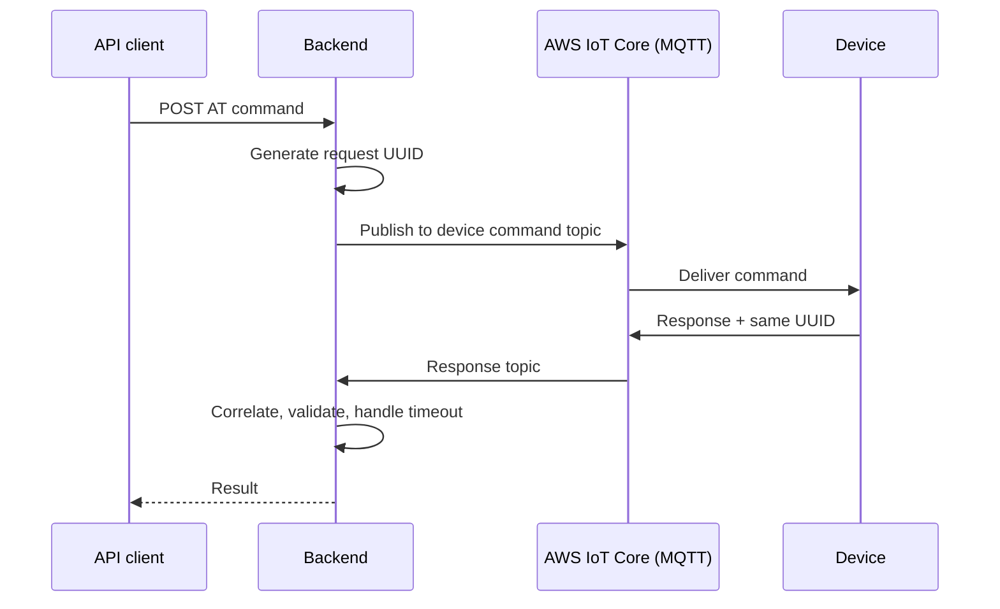

<h1 align="center">Sujith Ravikumar</h1>

<p align="center">
  <b>Cloud Engineer · IoT Cloud · Backend Systems</b><br/>
  I build the cloud and backend systems that connect physical devices to software.
</p>

<p align="center">
  <a href="https://linkedin.com/in/sujith-ravikumar"></a>
  <a href="mailto:sujithravikumar0306@gmail.com"></a>
  <a href="https://instagram.com/sujith_ravikumar_"></a>
</p>

---

## About

I'm a **Cloud Engineer at L&T Semiconductor Technologies**, an Indian fabless semiconductor company. I work on cloud platforms and connected-device systems: secure, scalable infrastructure that links embedded devices to cloud services and backend applications.

My work sits where four layers meet:

```
  Embedded Systems  ──►  Connectivity  ──►  Cloud  ──►  Backend
  MCU · firmware         LTE · Wi-Fi         AWS IoT      REST · GraphQL
  QCM2290 · QCX216       BLE · GNSS          Core · MQTT  PostgreSQL
  A/B OTA · DFOTA        TLS                 Lambda · S3  IAM · OAuth2
```

Day to day, that means AWS IoT Core, MQTT, device provisioning and lifecycle, telemetry, remote AT command execution, GNSS/TPS positioning, OTA/FOTA workflows and the backend APIs behind them, mostly for connected mobility and smart-device platforms.

I'm also doing an **M.Tech in Embedded Systems at BITS Pilani**, so I can work on both the device side and the cloud side.

---

## Selected work

| Project | What it is | Highlights |
|---|---|---|
| **SIPS**: Secure Identity & Provisioning Server | Identity and provisioning platform for users, organizations, factories, firmware releases, product catalog, TAC management and IMEI provisioning | Node.js · GraphQL · Prisma · PostgreSQL · Keycloak · OAuth2/JWT · Docker · AWS |
| **TPS / AT Command Server** | Runs AT commands on remote devices over MQTT, using per-device topics, request-UUID correlation, timeouts and response validation | Python · MQTT · AWS IoT Core · TLS · REST · EC2 |
| **QCM2290 A/B OTA** | A/B-partition OTA workflow for automotive and connected devices, with slot switching, boot validation and rollback | **99% fewer boot failures** |
| **DFOTA / QCX216** | Fault-tolerant firmware-over-the-air updates for connected embedded platforms: delivery, verification, slot activation | **60% faster OTA** |
| **Internal Dashboard Server** | Backend and dashboard for operational visibility and connected-device workflows | **Provisioning in under 2 seconds** |

<details>
<summary><b>How the AT Command Server works</b></summary>



</details>

---

## Experience

**Cloud Engineer**, L&T Semiconductor Technologies · *Mar 2025 – Present*
IoT cloud, device provisioning and lifecycle, telemetry, OTA/FOTA, backend APIs for connected mobility and smart devices.

**Software Engineer**, Buyerstage · *Jan 2024 – Jan 2025*
Backend and platform engineering: API development, database-backed services, faster delivery of backend workflows.

---

## Tech stack

**Languages**<br/>


**Backend**<br/>


**Cloud & IoT**<br/>


**Security & identity**<br/>


**DevOps**<br/>


**Embedded & automotive:** QCM2290 · QCX216 · RH850 · A/B partitioning · DFOTA · secure boot concepts · telematics · 2W connected clusters

---

## Education

- **M.Tech, Embedded Systems**, BITS Pilani · *Nov 2025 – Present*
- **B.Tech, Information Technology**, Dr. Mahalingam College of Engineering and Technology · GPA 9.2

---

<p align="center"><i>Device → Connectivity → Cloud → Backend</i></p>
